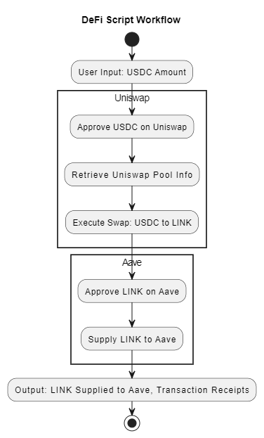

---

# DeFi Script: Uniswap & Aave Integration

## Overview of Script

This DeFi script demonstrates the integration of two leading decentralized finance (DeFi) protocols: Uniswap V3 and Aave. The script is designed to swap USDC for LINK using Uniswap V3 and then supply the acquired LINK to Aave to start earning interest. This workflow showcases the composability of DeFi protocols, enabling users to perform complex financial operations in a decentralized and permissionless manner.

### Key Steps:
1. **User Initiates Process:** The user begins by inputting the amount of USDC they wish to swap for LINK.
2. **Uniswap V3 Interaction:**
   - **Approve USDC:** The script approves the Uniswap V3 Swap Router to spend the user's USDC.
   - **Retrieve Pool Info:** The script retrieves the necessary pool information for the USDC/LINK pair from the Uniswap V3 Factory contract.
   - **Execute Swap:** The USDC is swapped for LINK using Uniswap V3's swap function.
3. **Aave Protocol Interaction:**
   - **Approve LINK:** The script approves the Aave protocol to spend the user's LINK.
   - **Supply LINK:** The LINK is supplied to Aave, allowing the user to earn interest on their holdings.
4. **Generate Transaction Receipts:** The script outputs transaction receipts for both the swap and the supply actions, providing the user with a record of the transactions.

This script can be deployed on the Ethereum Sepolia testnet, allowing users to experiment with DeFi functionalities without risking real assets.

## Diagram Illustration

The diagram below illustrates the sequence of steps and interactions between the protocols:

